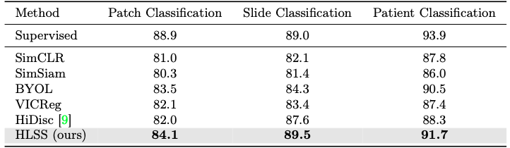

# Hierarchical Text-to-Vision Self Supervised Alignment for Improved Histopathology Representation Learning 

A **Hierarchical Language-tied Self-Supervised (HLSS)** framework for histopathology 

[Hasindri Watawana](https://hasindri.github.io),
[Kanchana Ranasinghe](https://scholar.google.com/citations?user=K2WBZTwAAAAJ&hl=en&authuser=1&oi=ao),
[Tariq Mahmood](https://www.ikca.org.uk/about-ikca/shaukat-khanum-hospital/),
[Muzammal Naseer](https://scholar.google.ch/citations?user=tM9xKA8AAAAJ&hl=en),
[Salman Khan](https://salman-h-khan.github.io),
and [Fahad Shahbaz Khan](https://scholar.google.es/citations?user=zvaeYnUAAAAJ&hl=en) 


## HLSS Overview


Self-supervised representation learning has been highly promising for histopathology image analysis with numerous approaches leveraging their patient-slide-patch hierarchy to learn better representations. In this paper, we explore how the combination of domain specific natural language information with such hierarchical visual representations can benefit rich representation learning for medical image tasks. Building on automated language description generation for features visible in histopathology images, we present a novel language-tied self-supervised learning framework, Hierarchical Language-tied Self-Supervision (\modelname) for histopathology images. We explore contrastive objectives and granular language description based text alignment at multiple hierarchies to inject language modality information into the visual representations. Our resulting model achieves state-of-the-art performance on two medical imaging benchmarks, OpenSRH and TCGA datasets. Our framework also provides better interpretability with our language aligned representation space.

## Installation

1. Clone HLSS github repo
   ```console
   git clone git@github.com:Hasindri/HLSS.git
   ```
2. Create conda environment
    ```console
    conda create -n hlss python=3.8
    ```
3. Activate conda environment
    ```console
    conda activate hlss
    ```
4. Install package and dependencies
    ```console
    pip install -r requirements.txt
    ```

## Directory organization
```
HLSS/
├── hlss/               # all code for HLSS related experiments
    ├── config/         # Configuration files used for training and evaluation
│   ├── datasets/       # PyTorch datasets to work with OpenSRH and TCGA
│   ├── losses/         # HiDisc loss functions with contrastive learning
│   ├── models/         # PyTorch models for training and evaluation
│   ├── wandb_scripts/  # Training and evaluation scripts  
├── figures/            # Figures in the README file
├── README.md
├── setup.py            # Setup file including list of dependencies
├── LICENSE             # MIT license for the repo
└── THIRD_PARTY         # License information for third party code
```

## Training / evaluation instructions

The code base is written using PyTorch Lightning, with custom network and
datasets for OpenSRH and TCGA.

To train HLSS on the OpenSRH dataset:

1. Download OpenSRH - request data [here](https://opensrh.mlins.org).
2. Update the sample config file in `config/train_hlss_attr3levels.yaml` with
    desired configurations.
3. Activate the conda virtual environment.
4. Use `train_hlss_KL.py` to start training:
    ```console
    python train_hlss_KL.py -c=config/train_hlss_attr3levels.yaml
    ```

To evaluate with your saved checkpoints and save metrics to a CSV file:
1. Update the sample config file in `config/eval_hlss_attr128_accplot.yaml` with
    the checkpoint directory path and other desired configurations.
2. Activate the conda virtual environment.
3. Use `eval_knn_hlss_accplot.py` for knn evaluation:
    ```console
    python eval_knn_hlss_accplot.py -c=config/eval_hlss_attr128_accplot.yaml
    ```

## Results
Our approach learns better representations of histopathology images from OpenSRH and TCGA datasets, as shown by the improved performance in kNN evaluation. 

 
 

## Contact

Should you have any questions, please create an issue in this repository or contact hasindri.watawana@mbzuai.ac.ae
<hr>

## References

Our code is build on the repository of [HiDisc](https://github.com/MLNeurosurg/hidisc). We thank them for releasing their code.

<hr>